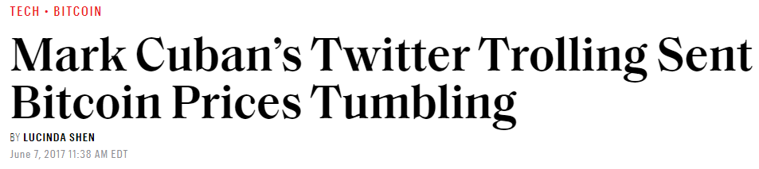
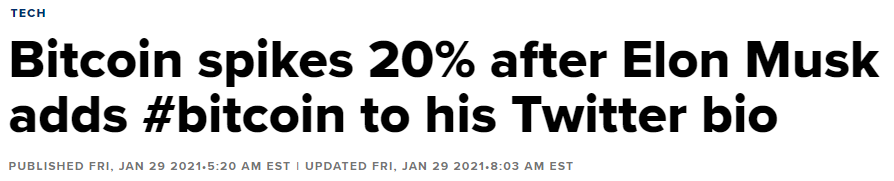
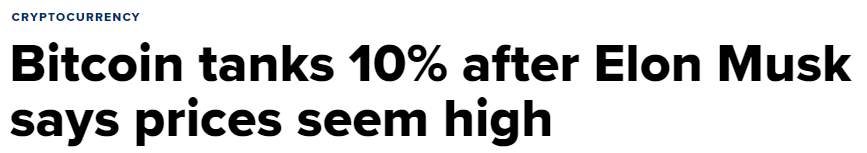
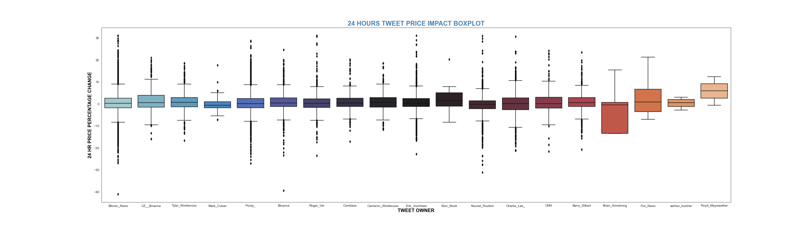
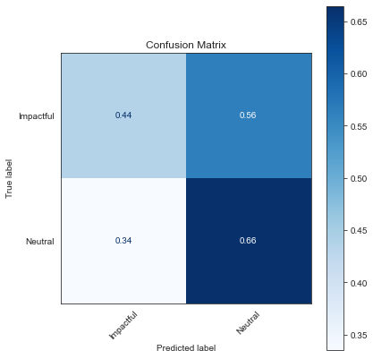
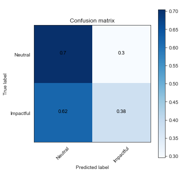

# The impact of Twitter comments on the price of Bitcoin
## Using Emsemble and NLP Methods

**Author:** Gabriel J. Araujo  
The contents of this repository detail an analysis of the Flatiron Data Science Capstone project. This analysis is detailed in hopes of making the work accessible and replicable.

**Business Problem**

On 18 August 2008, the domain name bitcoin.org was registered. Bitcoin is a cryptocurrency, a digital asset designed to work as a medium of exchange that uses cryptography to control its creation and management, rather than relying on central authorities. When this currency was first created, each coin was worth basically nothing. Today, a single coin is worth over $50,000.00. Most people, with myself included, have difficulties in understanding the reason for this high value, mainly because it is not a physical product and it isn't accepted by most banks and companies yet.

News such as the ones below makes me wonder, maybe Bitcoin is just a fad that is highly influenced on the comments of powerful and influential people. Perhaps, regular people see billionaires like Elon Musk and Mark Cuban making positive comments regarding Bitcoin and think: "If these guys, who are rich and powerful, believe in Bitcoin, it means that it must be really profitable and I could become rich like them.", when in reality, it isn't worth anything.

 

 

In this notebook, tweets from highly influential and powerful people, specially in the cryptocurrency community,  will be analyzed to determine if in fact their comments have an effect on the price of the biggest cryptocurrency  in the world today.

**Goals**

The goals of this project are:
- Determine if influential and powerful individuals do actually have an impact of the price of Bitcoin by analyzing their Twitter comments.
- Successfully scrappe archived tweets.
- Determine the best method to analyze and model tweets.

**Data**

Two datasets being analyzed in this project are Bitcoin Tweets and Bitcoin Hourly Historical Data. Bitcoin Tweets dataset was extracted from Twitter using Twint. Bitcoin Hourly Historical Data was downloaded from http://www.cryptodatadownload.com/data/gemini/ 

Bitcoin Tweets dataset consists of 6 features and 33,962 unique tweets that date to the year 2008.

Bitcoin Hourly Historical dataset consists of 4 features and 47,431 price observations that date back to the year 2008.

**Method**

 **Analysis Framework** 

This project will use the OSEMN framework (outlined in brief below)

**Obtain**
 
- Scrape tweets using Twint.
- Obtain historical Bitcoin price data.

**Scrub**
 
- Remove unwanted features (id, conversation_id, timezone, etc...).
- Fill/remove null values.
- Remove stop words from corpus.
- Remove mentions, retweets, emojis, and URLs.

**Explore**

- Lemmatize/Stem Word Tokens.
- Examine outliers text.
- Create Word Cloud.
- Interactive plots.

**Model**
- Random Forests Classifier.
- Naive Bayes.
- Deep NLP.

**Interpret**
- Results.
- Recommendations and Future Work.

**Scrapping tweets using Twint**

Twint is an advanced Twitter scraping tool written in Python that allows for scraping Tweets from Twitter profiles without using Twitter's API.   Twint utilizes Twitter's search operators to let you scrape Tweets from specific users, scrape Tweets relating to certain topics, hashtags & trends, or sort out sensitive information from Tweets like e-mail and phone numbers. Twint also makes special queries to Twitter allowing you to also scrape a Twitter user's followers, Tweets a user has liked, and who they follow without any authentication, API, Selenium, or browser emulation.  For more information, access https://pypi.org/project/twint/.

**Information taken Twint website (https://pypi.org/project/twint/).**

### Tweet Cleaning

**Preparing text data requires more processing than normal data.**
1. The following things must be removed:
    - Punctuation
    - Capitalization
    - Numbers
    
    
2. In most analyses, text needs to be **tokenzied** into a list of words and not remain in a sentence format.

3. It is always recommended to remove commonly used words that contain little information, called **Stop Words** (words like: the,was,he,she, it,etc...) from the machine learning algorithms. This is done in order to reduce the dimensionality of each corpus down to only the words that contain important information.

4. In most cases, each word token is reduced down to its root word. For cases such as "run", "runs", "running" and "ran", they are more similar than different, we may want our algorithm to treat these as the same word, "run".
  Simplifying words down to the basic core word (or word *stem*) is referred to as **"Stemming"**. A more advanced form of this also understands things like words that are just in a **different tense** such as  i.e.  **"ran", "run", "running"**. This process is called  **"lemmatization**, where the words are reduced to their simplest form, called "**lemmas**"  

    
|   Word   |  Stem | Lemma |
|:--------:|:-----:|:-----:|
|  Studies | Studi | Study |
| Studying | Study | Study |

5. Finally, we have to convert our text data into numeric form for our machine learning models to analyze, a process called **Vectorization**.  

| Document | dry | fruit | ... | intense |
|:--------:|:---:|:-----:|-----|---------|
|     1    |  0  |   3   | ... |    1    |
|     2    |  1  |   2   | ... |    0    |   

>   - **There are several different ways we can vectorize our text:**
      - Count vectorization
      - Term Frequency-Inverse Document Frequency (TF-IDF)
      - Word Embeddings (Deep NLP)
    
   
**Information taken from Flatiron School Natural Language Processing Section and from instructor James Irving.**

A portion of proprocessing was done prior to a proper train-test-split in order to extract the tweets' sentiment. Preprocessing was done again for the NLP models after a proper train-test-split.

**Exploring**

Below is a box plot that shows the distribution of how the price of Bitcoin changed 24 hours after a source posted a tweet. It can be seen that the mean stays consistent between all sources and most of them made enough posts that covers the whole range of price deviation. 

There are individuals, like Mark Cuban, Elon Musk, Brian Armstrong, and Fox News, who do not make many comments regarding Bitcoin, have isolated points on the plot, which could mean that on that day, the comment was impactful. 

After analyzing their tweets, it was noticed that there were times when Elon Musk and Mark Cuban wrote a positive tweet regarding cryptocurrency, the price went up drastically.It is really difficult to state that those price changes were caused by the actual tweets, because there were instances where comments were made, but there were no significant changes.

Other sources, such as Brian Armstrong and Fox News, only tweeted commenting on big crypto related events that occurred that day. It can be stated that the price fluctuations were caused by other sources, such as government intervention and corruption scandals.

**Word Cloud**

**Modeling**

A column named 24hr_change was engineered to measure the impact of a tweet 24 hours it was posted. Then, the values in the column were changed to either **Neutral** or **Impactful**. These will be the categories for the ML models. A percent change greater than 5% and smaller than -5% will be considered impactful. Any value that lies between the two will be considered neutral. Those values were chosen because they are about 1 standard deviation from the mean and above 75% and below 25% mark. The assumption is that impactful tweets should be rare. 

I didn't want to do a negative or positive categorical model because I am not interested in knowing if a person's comment is going to make the value of the currency go up or down, I am interested in identifying people or comments that have a big impact in the currency.

**Random Forest Classifier**

The first model is Random Forest classifier that did not analyze the tweet text like an NLP model. The input variables were the sentiment of the tweet, name of the author,length of tweet, and the number of replies, retweets, and likes that specific tweet received. Tweet sources were weighted. A source that makes frequent posts about Bitcoin will have a lower weight, and sources that rarely makes any comments will have a bigger weight. 

**Deep NLP**

A Recurrent Neural Network was used to analyze the tweets. By using word embeddings, the model will be able to learn the meaning of the words used in the tweets. This more complex approach should be able to identify the subtle differences between the comments.

- **Recurrent Neural Networks** are used to evaluate Sequences of data, rather than just individual data points. All text data is sequence data by default; a letter only makes sense when it's words are in the proper order. RNNs excel at NLP tasks, because they can take in text as full sequences of words, from a single sentence up to an entire document or book! Because of this, they do not suffer the same loss of information that comes from a traditional Bag-of-Words vectorization approach.

- **Word Embeddings** are a type of vectorization strategy that computes word vectors from a text corpus by training a neural network, which results in a high-dimensional embedding space, where each word in the corpus is a unique vector in that space. In this embedding space, the position of the vector relative to the other vectors captures semantic meaning. RNN can use word embeddings by creating an empty embedding layer at the beginning of the sequential model, by using a pre-trained **Word 2 Vec** word embedding from your own dataset, or by using **GloVe**, which is a pre-trained word embedding from a large data bank, such as Wikipedia.

 **Information taken from Flatiron School DEEP NLP Section.**
 
**Conclusion**

As stated at the beginning of the notebook, the goals of this project were:

1. Successfully scrappe archived tweets.
2. Determine if influential and powerful individuals do actually have an impact of the price of Bitcoin by analyzing their Twitter comments.
- Determine the best method to analyze and model tweets.

Only 1 goal, to successfully scrappe archived tweets, was achieved successfully. They will be explained more in depth below.

1. **Successfully scrappe archived tweets.**

    At first, the Tweepy Python library was used to collect the tweets used in this project. The library had several limitations:
    - Needing an access to Twitter's API. The approval process can take weeks, depending on what the user wants to do.
    - Not being able to do Advanced Searches.
    - Tweets limitation. Only last 3,200 tweets can be extracted.
    - Needing to pay to get archived tweets.
    
   Thankfully I found the Twint python library. With only 6 lines of code, I was able to collect 33,962 tweets, dating back to 2008, from multiple users. Some of the benefits of using Twint vs Twitter API:

    - Can fetch almost all Tweets (Twitter API limits to last 3200 Tweets only).
    - Fast initial setup.
    - Can be used anonymously and without Twitter sign up.
    - No rate limitations.
      
2. **Determine if influential and powerful individuals do actually have a deep influence in the price of Bitcoin by analyzing their Twitter comments.**
    
    After a thorough analysis of the tweets, it could not be affirmed with confidence that influential and powerful individuals have a deep influence in the price of Bitcoin. The examples presented in the introduction must have been independent events, and after a few days the price corrected itself. Also, there were days where multiple people posted comments with different sentiments, even though on one of the models the sources were weighted, it's really hard to know which one of the sources is correct. Based on the findings, below are my recommendations:
    
    - I consider it to be very risky to invest money in Bitcoin based on comments from such people. It's not known if a comment will be impactful or not, and if it is, the price soon corrects itself.
    - Tweets could not be a good source of information. People can make several posts on the same day with different opinions. I suggest also using other sources of information, such as news articles, to make investment decisions.
    - If you really want to buy Bitcoin after people like Elon Musk talk about it, I suggest selling it after a few hours or days to guarantee the winnings. 
    
     ***None of this information should be used as actual investment advice. Do your own research to decide what is the best investment decision for you.** 
     
3. **Determine the best method to analyze and model tweets.**
    
    Since all models made had poor performance, I was not able to determine the best method to analyze and model tweets.
    

**Random Forrest Classifier Confusion Matrix**

    

The random forest model with just the engineered columns did not perform too well. It only correctly classified 67% of the Neutral tweets and 41% of the impactful tweets. Since there is a significant class imbalance, most of the models predictions are falling into the neutral categories.

**RNN Confusion Matrix**

 

The Recurrent Neural Network was not able to understand the complexity of the task. It can be seen after the 3rd epoch that the model stopped improving. The model achieved a testing accuracy of 59.95%.

**Future Work**

If I were given more time to work on this project, I would do the following things to improve it:
- Collect data from more sources, such as news websites, to improve the analysis.
    - In most cases, the more data, the better. By not having a tweet for every day, important information could have been missed.   
- Tune Random Forest and Deep NLP models to increase their accuracy.  
- Look at incorrect predictions to see if there's a pattern.
    - Perhaps the text needs to be cleaned better or something can be engineered to help the model's understanding.  
- Analyze the stock market to see if there is any correlation between the two.
    - Bitcoin prices increases because people are taking money away from the stock market and investing in cryptocurrencies.
